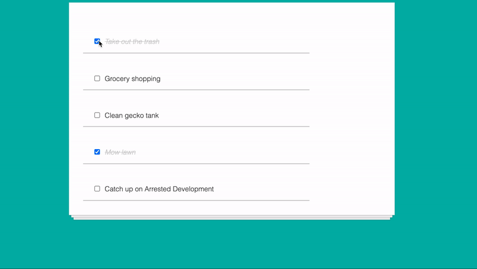

### Description

This is a todo-list app design that interact with pre-existed data.
Using ReactJS

### Demonstration

### `yarn start` or `npm start`

Runs the app in the development mode.\
Open [http://localhost:3000](http://localhost:3000) to view it in the browser.

The page will reload if you make edits.\
You will also see any lint errors in the console.
